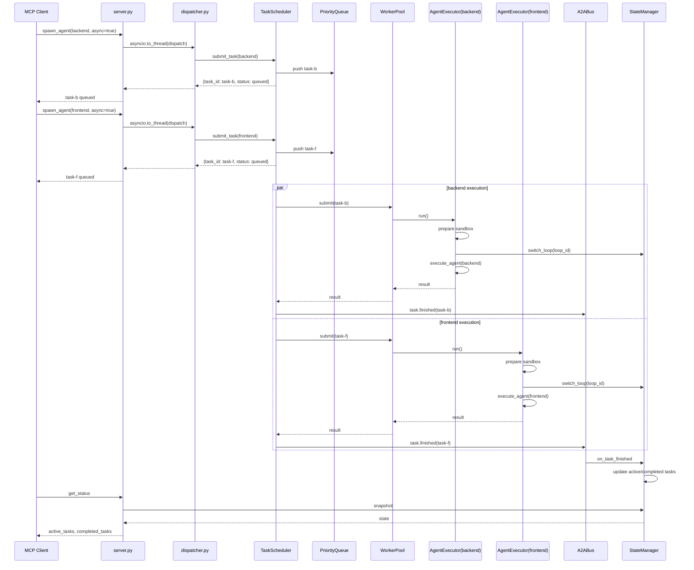

# Loop-Harness-Agent MCP 多 Agent 并行调度架构设计方案

**版本**: v1.0  
**日期**: 2026-06-20  
**编写角色**: @Architect  
**适用范围**: loop-agent-mcp v1.4+  
**关联文档**: [项目演进教学文档](../MCP项目演进教学文档_v1.3.md)

---

## 1. 背景与问题

### 1.1 当前瓶颈

当前 `loop-agent-mcp` v1.3 的 `spawn_agent` 工具调用链路如下：

```
MCP Client
    │
    ▼
server.py:74 ──asyncio.to_thread(dispatch, ...)──▶
    │
    ▼
tools/dispatcher.py:67 dispatch(name="spawn_agent")
    │
    ▼
tools/dispatcher.py:142 orch.spawn_agent(...)      (同步状态更新)
tools/dispatcher.py:148 execute_agent(...)         (同步代码生成)
    │
    ▼
返回合并结果
```

关键问题：

1. **伪并行**：`server.py` 用 `asyncio.to_thread` 只是把同步的 `dispatch` 扔到默认线程池，每个 `spawn_agent` 内部仍是单线程串行执行（先状态更新，再执行，再返回）。
2. **无 Task 抽象**：没有独立的 `Task` 对象，任务生命周期、优先级、依赖关系全部缺失。
3. **无调度器**：没有任务队列、worker 池、并发度控制，无法做到 "backend 与 frontend 同时跑"。
4. **状态未隔离**：所有 agent 共用同一个 `StateManager` 单例，并行写 `active_tasks` 存在竞争条件；agent 私有文件都在同一个 workspace 下，可能互相覆盖。
5. **无 A2A 协议**：agent 间、agent 与 orchestrator 之间没有标准化消息协议，无法做状态通知、结果聚合、失败恢复。
6. **失败不可恢复**：任务失败即失败，没有重试、错误传播、部分失败聚合机制。

### 1.2 设计目标

- 真正独立并行：多个 agent 任务同时运行，互不阻塞。
- 状态隔离：每个任务有独立上下文、私有工作区、独立生命周期。
- 结果聚合：orchestrator 能汇总多个 agent 结果，触发下一步。
- 失败恢复：支持重试、超时、取消、部分失败处理。
- 最小侵入：优先复用现有 `StateManager`、`BaseExecutor`、`dispatcher`、`server.py`，控制改动面。

---

## 2. 总体架构

### 2.1 架构拓扑

```text
┌─────────────────────────────────────────────────────────────────────┐
│                        MCP Client (Trae / Claude)                    │
└─────────────────────────────────────────────────────────────────────┘
                                    │
                                    ▼
┌─────────────────────────────────────────────────────────────────────┐
│                         loop_agent_mcp/server.py                     │
│  ┌──────────────────────────────────────────────────────────────┐  │
│  │  async call_tool()                                            │  │
│  │   ├── spawn_agent    ──▶  TaskScheduler.submit_task()         │  │
│  │   ├── cancel_task    ──▶  TaskScheduler.cancel_task()         │  │
│  │   └── get_status     ──▶  StateManager.snapshot()             │  │
│  └──────────────────────────────────────────────────────────────┘  │
└─────────────────────────────────────────────────────────────────────┘
                                    │
                                    ▼
┌─────────────────────────────────────────────────────────────────────┐
│                       loop_agent_mcp/runtime/                        │
│  ┌─────────────────┐    ┌─────────────────┐    ┌─────────────────┐  │
│  │  TaskScheduler  │◄──►│   WorkerPool    │◄──►│   TaskStore     │  │
│  │  (调度器)        │    │   (worker 池)    │    │  (任务状态持久化) │  │
│  └────────┬────────┘    └────────┬────────┘    └─────────────────┘  │
│           │                      │                                  │
│           ▼                      ▼                                  │
│  ┌─────────────────┐    ┌─────────────────┐                        │
│  │   A2A Bus       │    │  AgentExecutor  │                        │
│  │  (消息总线)      │    │  (执行隔离封装)   │                        │
│  └─────────────────┘    └─────────────────┘                        │
└─────────────────────────────────────────────────────────────────────┘
                                    │
                    ┌───────────────┼───────────────┐
                    ▼               ▼               ▼
        ┌─────────────────┐ ┌─────────────────┐ ┌─────────────────┐
        │  Shared State   │ │ Per-Task State  │ │  Per-Task Workspace│
        │  (StateManager) │ │  (TaskContext)  │ │  (sandbox)      │
        └─────────────────┘ └─────────────────┘ └─────────────────┘
```

### 2.2 核心组件职责

| 组件 | 职责 | 与现有代码关系 |
|------|------|----------------|
| `Task` | 任务抽象：ID、状态、优先级、依赖、结果、重试计数 | 新增 |
| `TaskScheduler` | 接收任务、维护队列、按策略派发、处理取消/超时 | 新增，替换 dispatcher 中 spawn_agent 的同步执行 |
| `WorkerPool` | 管理一组 worker，控制并发度，隔离执行环境 | 新增 |
| `AgentExecutor` | 包装现有 `execute_agent`，注入 TaskContext，捕获结果/异常 | 新增，复用 `executors.py` |
| `TaskStore` | 任务级持久化（内存 + 可选 JSONL），支持恢复 | 新增 |
| `A2ABus` | 轻量级消息总线：agent 状态通知、orchestrator 广播 | 新增 |
| `TaskContext` | 每个任务的私有上下文（工作区、日志、变量） | 新增 |
| `StateManager` | 继续负责 Loop 级全局状态，但增强并发安全 | 现有，增强 |

---

## 3. 任务模型

### 3.1 Task 抽象

每个 `spawn_agent` 调用被封装为一个 `Task` 对象。

```python
class TaskStatus(Enum):
    PENDING = "pending"           # 等待依赖满足
    QUEUED = "queued"             # 已进入调度队列
    RUNNING = "running"           # 正在执行
    SUCCEEDED = "succeeded"       # 成功完成
    FAILED = "failed"             # 失败（可重试次数已耗尽）
    CANCELLED = "cancelled"       # 被取消
    TIMEOUT = "timeout"           # 超时
    BLOCKED = "blocked"           # 依赖未满足或被门禁阻塞


@dataclass
class Task:
    task_id: str                  # 全局唯一，如 task-{uuid}
    loop_id: str                  # 所属 Loop
    agent_name: str               # 目标 agent 角色
    task_input: dict[str, Any]    # 任务输入参数

    # 生命周期
    status: TaskStatus = TaskStatus.PENDING
    created_at: float = field(default_factory=time.time)
    started_at: float | None = None
    finished_at: float | None = None

    # 调度属性
    priority: int = 5             # 1-10，数值越小优先级越高
    dependencies: list[str] = field(default_factory=list)  # 依赖 task_id
    max_retries: int = 2
    retry_count: int = 0
    timeout_seconds: float = 600.0

    # 执行上下文
    context: TaskContext | None = None

    # 结果与审计
    result: dict[str, Any] = field(default_factory=dict)
    error: dict[str, Any] | None = None
    logs: list[dict[str, Any]] = field(default_factory=list)
    audit_trail: list[dict[str, Any]] = field(default_factory=list)

    def is_terminal(self) -> bool:
        return self.status in (
            TaskStatus.SUCCEEDED,
            TaskStatus.FAILED,
            TaskStatus.CANCELLED,
            TaskStatus.TIMEOUT,
        )
```

### 3.2 任务生命周期状态机

```text
                    ┌─────────────┐
          ┌────────►│   PENDING   │◄────────┐
          │         │  (依赖检查)  │         │
          │         └──────┬──────┘         │
          │                │ 依赖满足        │
          │                ▼                │
          │         ┌─────────────┐         │
          │         │   QUEUED    │         │
          │         │  (入任务队列) │         │
          │         └──────┬──────┘         │
          │                │ worker 领取    │
          │                ▼                │
          │         ┌─────────────┐         │
          │    ┌───►│   RUNNING   │         │
          │    │    │  (执行中)    │         │
          │    │    └──────┬──────┘         │
          │    │           │                │
    依赖未满足│    │      成功 │ 失败/超时      │ 取消
          │    │           ▼                │
          │    │    ┌─────────────┐   ┌─────────────┐
          │    └────│  SUCCEEDED  │   │   FAILED    │
          │         │  (结果可用)  │   │(可重试/不可重试)│
          │         └─────────────┘   └──────┬──────┘
          │                                  │
          │                        可重试且次数未耗尽
          │                                  │
          └──────────────────────────────────┘
```

### 3.3 依赖关系

- **硬依赖**（`depends_on`）：任务 B 必须等任务 A 成功后才能启动。失败则 B 进入 `BLOCKED`。
- **软依赖**（`informs`）：任务 B 可以启动，但会读取 A 的中间结果；A 失败不影响 B 启动，只影响结果聚合。
- **阶段依赖**：由 orchestrator 根据 `PHASE_ORDER` 和 `PHASE_ROLE_MAP` 自动生成，例如 Phase 5 的 backend 与 frontend 任务默认互为软依赖，便于同时启动但结果需聚合。

---

## 4. 执行模型

### 4.1 并发单元选型分析

| 方案 | 优势 | 劣势 | 适用场景 |
|------|------|------|----------|
| 线程 (`threading`) | 共享内存、启动快、与现有同步 `execute_agent` 兼容 | 受 GIL 限制，CPU 密集型并行无优势；需注意共享状态锁 | **推荐**：当前代码以 I/O 和文件写为主，线程足够 |
| 原生协程 (`asyncio`) | 轻量、高并发 | 现有 `execute_agent` 是同步的，需大量改造 | 仅当未来执行器全面 async 化后适用 |
| 子进程 (`multiprocessing`) | 真并行、GIL 隔离、崩溃隔离好 | 内存开销大、序列化复杂、共享状态困难 | 用于运行不可信代码或重型 LLM 调用 |
| 外部子进程 (`subprocess`) | 最强隔离、可独立 kill | 启动慢、通信复杂 | 用于运行测试、构建、部署脚本 |

**推荐组合策略**：

- **默认执行层**：`asyncio` 事件循环 + `asyncio.to_thread` 将同步 `execute_agent` 丢到线程池 worker 执行。保持与现有同步代码兼容，同时让多个 MCP 请求/任务并发。
- **CPU 密集型/隔离型任务**：可选子进程执行器（如运行 pytest、build、llm-heavy 任务），通过 `ProcessPoolExecutor` 或外部进程池。
- **不可信/危险操作**：强制子进程 + sandbox 工作区，主进程不直接执行。

### 4.2 Worker 池设计

```python
class WorkerPool:
    """基于 asyncio + ThreadPoolExecutor 的 worker 池。"""

    def __init__(
        self,
        max_workers: int = 8,
        process_workers: int = 2,
    ):
        self.max_workers = max_workers
        # 通用线程池：文件生成、代码生成等 I/O 密集型任务
        self._thread_pool = ThreadPoolExecutor(max_workers=max_workers)
        # 进程池：CPU 密集型、隔离型任务
        self._process_pool = ProcessPoolExecutor(max_workers=process_workers)
        # 正在运行的 future 映射，用于取消
        self._running: dict[str, asyncio.Task] = {}
        self._lock = asyncio.Lock()

    async def submit(
        self,
        task: Task,
        executor_factory: Callable[[Task], Callable[..., dict]],
    ) -> dict:
        """提交任务到 worker 池。"""
        loop = asyncio.get_event_loop()

        if task.execution_mode == "subprocess":
            # 外部进程 / sandbox
            return await self._run_in_subprocess(task)
        elif task.execution_mode == "process":
            # 进程池
            return await loop.run_in_executor(
                self._process_pool,
                executor_factory(task),
                task,
            )
        else:
            # 默认线程池
            return await loop.run_in_executor(
                self._thread_pool,
                executor_factory(task),
                task,
            )

    async def cancel(self, task_id: str) -> bool:
        async with self._lock:
            future = self._running.get(task_id)
            if future and not future.done():
                future.cancel()
                return True
            return False
```

**默认并发度**：

- 线程 worker 数：`min(32, (os.cpu_count() or 1) * 4)`，但可配置上限 16，避免文件系统争用。
- 同一 loop 内并发任务数：默认 4（backend/frontend/tester/performance 可同时跑），避免同一项目文件冲突。
- 全局跨 loop 并发任务数：默认 8。

### 4.3 Agent 执行隔离机制

每个任务在 `AgentExecutor` 中被包装，隔离维度如下：

```python
class AgentExecutor:
    """包裹现有 execute_agent，注入任务级隔离。"""

    def __init__(self, task: Task):
        self.task = task
        self.context = task.context or TaskContext.create(task)

    def run(self) -> dict[str, Any]:
        # 1. 创建私有工作区 sandbox
        self.context.prepare_workspace()

        # 2. 切换当前 Loop 上下文
        StateManager.get().switch_loop(self.task.loop_id)

        # 3. 在 TaskContext 内运行现有执行器
        try:
            # 注入 task_input：增加 task_id / workspace 覆盖
            enriched_input = {
                **self.task.task_input,
                "_task_id": self.task.task_id,
                "_workspace": str(self.context.workspace),
            }
            result = execute_agent(self.task.agent_name, enriched_input)
        except Exception as e:
            result = {
                "status": "error",
                "agent": self.task.agent_name,
                "error": str(e),
                "execution_failed": True,
            }
        finally:
            # 4. 合并结果到 task，记录审计
            self.context.finalize(result)

        return result
```

**隔离方式**：

| 隔离维度 | 机制 | 说明 |
|----------|------|------|
| 文件隔离 | 每个任务有 `workspace/.loop-agent-tasks/{task_id}/` 私有目录 | agent 默认只能写自己的 sandbox；需要共享时通过 `shared/` 目录 |
| 状态隔离 | `TaskContext` 持有任务私有变量 | 不直接修改 `StateManager` 的任务级字段 |
| 日志隔离 | 每个任务有独立日志文件 | 路径：`workspace/.loop-agent-tasks/{task_id}/task.log` |
| 超时隔离 | `asyncio.wait_for` + `concurrent.futures.TimeoutError` | 单任务超时不会拖垮整个 worker 池 |
| 异常隔离 | worker 内 try/except | 单个任务异常不会影响其他任务 |

---

## 5. 调度器设计

### 5.1 TaskScheduler 结构

```python
class TaskScheduler:
    """多 agent 任务调度器。"""

    def __init__(
        self,
        max_concurrent: int = 4,
        default_timeout: float = 600.0,
    ):
        self.max_concurrent = max_concurrent
        self.default_timeout = default_timeout

        # 优先级队列：heapq，按 (priority, created_at, task_id) 排序
        self._queue: list[tuple[int, float, str]] = []
        self._tasks: dict[str, Task] = {}
        self._lock = asyncio.Lock()
        self._semaphore = asyncio.Semaphore(max_concurrent)
        self._pool = WorkerPool()
        self._bus = A2ABus()
        self._store = TaskStore()

    async def submit_task(
        self,
        agent_name: str,
        task_input: dict[str, Any],
        *,
        loop_id: str | None = None,
        priority: int = 5,
        dependencies: list[str] | None = None,
        timeout: float | None = None,
    ) -> Task:
        """提交新任务。"""
        task = Task(
            task_id=f"task-{uuid.uuid4().hex[:12]}",
            loop_id=loop_id or StateManager.get().active_loop_id or "",
            agent_name=agent_name,
            task_input=task_input,
            priority=priority,
            dependencies=dependencies or [],
            timeout_seconds=timeout or self.default_timeout,
        )
        # 持久化
        await self._store.save(task)
        # 放入队列
        async with self._lock:
            heapq.heappush(self._queue, (task.priority, task.created_at, task.task_id))
            self._tasks[task.task_id] = task
            task.status = TaskStatus.QUEUED
        # 触发调度
        asyncio.create_task(self._dispatch())
        return task

    async def _dispatch(self):
        """从队列中取出可调度任务并执行。"""
        async with self._lock:
            if not self._queue:
                return
            # 检查并发槽
            if self._semaphore.locked():
                return
            _, _, task_id = heapq.heappop(self._queue)
            task = self._tasks[task_id]

            # 检查依赖
            if not await self._dependencies_satisfied(task):
                task.status = TaskStatus.BLOCKED
                # 重新入队（稍后重试）
                heapq.heappush(self._queue, (task.priority, time.time(), task.task_id))
                return

        await self._execute(task)

    async def _execute(self, task: Task):
        async with self._semaphore:
            task.status = TaskStatus.RUNNING
            task.started_at = time.time()
            await self._store.save(task)
            await self._bus.publish(TaskStartedEvent(task))

            try:
                result = await asyncio.wait_for(
                    self._pool.submit(task, AgentExecutor),
                    timeout=task.timeout_seconds,
                )
                task.result = result
                if result.get("status") == "error":
                    await self._handle_failure(task, result)
                else:
                    task.status = TaskStatus.SUCCEEDED
            except asyncio.TimeoutError:
                task.status = TaskStatus.TIMEOUT
                task.error = {"type": "timeout", "limit": task.timeout_seconds}
            except Exception as e:
                await self._handle_failure(task, {"error": str(e)})
            finally:
                task.finished_at = time.time()
                await self._store.save(task)
                await self._bus.publish(TaskFinishedEvent(task))

    async def cancel_task(self, task_id: str) -> bool:
        async with self._lock:
            task = self._tasks.get(task_id)
            if not task or task.is_terminal():
                return False
        await self._pool.cancel(task_id)
        task.status = TaskStatus.CANCELLED
        await self._store.save(task)
        await self._bus.publish(TaskCancelledEvent(task))
        return True
```

### 5.2 调度策略

| 策略 | 说明 | 默认启用 |
|------|------|----------|
| 优先级调度 | 1-10 优先级，同优先级 FIFO | 是 |
| 依赖等待 | 硬依赖未满足时任务保持 `BLOCKED`，不占用 worker | 是 |
| 同 Loop 并发上限 | 同一 Loop 内同时运行任务数 ≤ `max_concurrent` | 是 |
| 同 Agent 并发上限 | 同一 agent 角色同时运行任务数 ≤ `agent_concurrency_limit` | 是，避免同一角色资源争用 |
| 抢占/取消 | 高优先级任务可取消低优先级任务（可选，默认关闭） | 否 |
| 回填调度 | worker 空闲时立即从队列取下一个任务 | 是 |

### 5.3 取消与超时

- **取消**：`TaskScheduler.cancel_task(task_id)` 设置取消标志；线程池任务通过 `future.cancel()` + 执行器内部轮询 `is_cancelled()` 实现协作式取消。
- **超时**：`asyncio.wait_for` 硬超时，超时后任务状态置 `TIMEOUT`，worker future 取消。
- **全局 Loop 超时**：由 `time_budget_hours` 转换成的绝对 deadline，所有任务统一检查。

---

## 6. A2A / 消息协议

### 6.1 消息总线 A2ABus

A2A 消息用于 agent 间通信、agent 与 orchestrator 间的状态通知，**不用于直接调用工具**。

```python
class A2AMessage:
    message_id: str
    topic: str                      # domain.action.subject
    sender: str                     # agent_name / orchestrator
    receiver: str | None            # None 表示广播
    payload: dict[str, Any]
    timestamp: float
    correlation_id: str | None      # 关联 task_id / loop_id

class A2ABus:
    """内存级轻量消息总线，支持 pub/sub。"""

    def __init__(self):
        self._subscribers: dict[str, list[Callable]] = defaultdict(list)

    async def publish(self, message: A2AMessage):
        for handler in self._subscribers.get(message.topic, []):
            asyncio.create_task(handler(message))

    def subscribe(self, topic: str, handler: Callable):
        self._subscribers[topic].append(handler)
```

### 6.2 标准 Topic 与消息格式

继承 A2A 速查卡，扩展任务生命周期相关 topic：

| Topic | 方向 | 说明 |
|-------|------|------|
| `task.submitted` | orchestrator → all | 任务已提交 |
| `task.started` | AgentExecutor → all | 任务开始执行 |
| `task.progress` | AgentExecutor → orchestrator | 执行进度（如文件生成数） |
| `task.finished` | AgentExecutor → all | 任务完成（成功/失败/超时/取消） |
| `task.failed` | AgentExecutor → orchestrator | 任务失败，可触发重试 |
| `task.cancelled` | orchestrator → all | 任务被取消 |
| `task.retry` | orchestrator → all | 任务正在重试 |
| `gate.request` | orchestrator → gate_keeper | 请求运行某门禁 |
| `gate.completed` | gate_keeper → orchestrator | 门禁结果 |
| `state.changed` | StateManager → all | Loop 状态变更 |

**消息示例**（`task.finished`）：

```json
{
  "message_id": "msg-uuid-001",
  "topic": "task.finished",
  "sender": "backend",
  "receiver": null,
  "correlation_id": "task-abc123",
  "timestamp": 1718870400.0,
  "payload": {
    "task_id": "task-abc123",
    "loop_id": "loop-xyz789",
    "agent_name": "backend",
    "status": "succeeded",
    "files_created": ["src/api/users.ts", "src/types/users.ts"],
    "quality_score": {"score": 85, "grade": "B"},
    "duration_ms": 3420
  }
}
```

### 6.3 Orchestrator 与 Agent 交互

```text
Orchestrator                          AgentExecutor
     │                                    │
     │  [REQ] spawn_agent(backend)        │
     │ ────────────────────────────────►  │
     │                                    │
     │        task.started                │
     │ ◄────────────────────────────────  │
     │        task.progress               │
     │ ◄────────────────────────────────  │
     │        task.finished               │
     │ ◄────────────────────────────────  │
     │                                    │
     │  aggregate results                 │
     │  decide next step                  │
     │                                    │
```

### 6.4 状态通知格式

所有任务状态变更通过 `A2ABus` 发布，`StateManager` 订阅 `task.finished` 等事件以更新 Loop 状态：

```python
def on_task_finished(message: A2AMessage):
    payload = message.payload
    task_id = payload["task_id"]
    status = payload["status"]

    StateManager.get().mutate(lambda s: {
        s.active_tasks.remove(task_id) if task_id in s.active_tasks else None,
        s.completed_tasks.append(task_id) if status == "succeeded" else None,
        s.blocked_tasks.append(task_id) if status == "failed" else None,
    })
```

---

## 7. 状态隔离与并发安全

### 7.1 StateManager 并发安全增强

当前 `StateManager` 已使用 `threading.Lock` 保护 `_states` 和 `mutate()`，但在并行任务场景下需要额外注意：

1. **`active_loop_id` 线程局部问题**：多个任务同时切换 loop 会导致混乱。
2. **`active_tasks` 并发追加/删除**：多个 worker 同时修改同一 list。
3. **持久化写放大**：每个任务频繁 `mutate` 会触发磁盘写。

**改造方案**：

```python
class StateManager:
    # 新增：线程局部当前 loop
    _local = threading.local()

    @property
    def state(self) -> LoopState:
        # 优先使用线程局部 active_loop_id，避免多任务切换冲突
        local_loop_id = getattr(self._local, "loop_id", None)
        if local_loop_id and local_loop_id in self._states:
            return self._states[local_loop_id]
        # 回退全局 active_loop_id
        return self._get_global_state()

    def set_thread_loop(self, loop_id: str):
        self._local.loop_id = loop_id

    def mutate(self, fn) -> Any:
        with self._state_lock:
            state = self.state
            old_id = state.loop_id
            result = fn(state)
            state.last_update = time.time()
            if state.loop_id != old_id:
                self._states.pop(old_id, None)
                self._states[state.loop_id] = state
                self._active_loop_id = state.loop_id
            # 异步持久化，避免阻塞 worker
            if self._persistence and self._active_loop_id:
                asyncio.create_task(self._async_save(self._active_loop_id))
            return result

    async def _async_save(self, loop_id: str):
        state = self._states.get(loop_id)
        if state:
            self._persistence.save_state(loop_id, state.to_dict())
```

### 7.2 每个任务的私有状态 / 工作区

```python
class TaskContext:
    """任务级上下文，提供隔离的执行环境。"""

    def __init__(self, task: Task):
        self.task = task
        self.workspace = self._resolve_workspace()
        self.log_path = self.workspace / "task.log"
        self.output_dir = self.workspace / "output"
        self.shared_dir = self._resolve_shared_dir()

    @classmethod
    def create(cls, task: Task) -> "TaskContext":
        ctx = cls(task)
        ctx.prepare_workspace()
        return ctx

    def prepare_workspace(self):
        self.workspace.mkdir(parents=True, exist_ok=True)
        self.output_dir.mkdir(exist_ok=True)
        # agent 写文件默认限制在 workspace 内
        # 如需提交到项目根目录，通过 context.commit_output() 显式合并

    def commit_output(self, target_workspace: Path):
        """将任务产出合并到项目工作区（带冲突检测）。"""
        for src in self.output_dir.rglob("*"):
            if src.is_file():
                rel = src.relative_to(self.output_dir)
                dst = target_workspace / rel
                if dst.exists():
                    # 冲突：生成 .conflict 文件，由 orchestrator 决策
                    dst = dst.with_suffix(dst.suffix + ".conflict")
                dst.parent.mkdir(parents=True, exist_ok=True)
                shutil.copy2(src, dst)

    def _resolve_workspace(self) -> Path:
        base = Path(StateManager.get().state.workspace or find_workspace_root())
        return base / ".loop-agent-tasks" / self.task.task_id
```

### 7.3 共享状态访问规则

| 状态 | 访问方式 | 并发控制 |
|------|----------|----------|
| Loop 全局状态 | `StateManager` | `threading.Lock` + 异步持久化 |
| 任务状态 | `TaskStore` | `asyncio.Lock` |
| Agent 间消息 | `A2ABus` | `asyncio` 协程级 |
| 文件系统 | 私有 workspace + commit_output | 合并时加锁 |
| 审计日志 | `ToolAuditLogger` | `threading.Lock`（现有） |

---

## 8. 失败恢复

### 8.1 任务重试

```python
async def _handle_failure(self, task: Task, result: dict):
    task.retry_count += 1
    task.error = result.get("error", "unknown error")

    if task.retry_count <= task.max_retries:
        task.status = TaskStatus.PENDING
        # 指数退避
        backoff = 2 ** task.retry_count
        await asyncio.sleep(backoff)
        await self._store.save(task)
        await self._bus.publish(TaskRetryEvent(task))
        # 重新入队
        async with self._lock:
            heapq.heappush(self._queue, (task.priority, time.time(), task.task_id))
        asyncio.create_task(self._dispatch())
    else:
        task.status = TaskStatus.FAILED
        await self._store.save(task)
        await self._bus.publish(TaskFailedEvent(task))
```

### 8.2 错误传播

- **同任务内错误**：捕获异常，记录到 `task.error`，按重试策略处理。
- **跨任务错误**：通过 A2A `task.failed` 通知 orchestrator，orchestrator 决定是阻断后续依赖任务还是降级继续。
- **致命错误**：如任务创建文件越界、安全违规，立即置 `FAILED` 不重试，并触发偏离检测。

### 8.3 部分失败处理

当 Phase 5 并行派发 backend + frontend，其中 backend 失败但 frontend 成功时：

```text
Orchestrator 策略：
  1. 收集所有 task.finished 结果
  2. 判断失败影响面
  3. 若失败任务为关键路径（如 backend API 是 frontend 依赖）
     → 阻塞 frontend 后续步骤，回到 Phase 5 修复
  4. 若失败任务为非关键路径
     → 记录偏离，允许进入 Gate 1，但需在 Gate 1 中说明
```

### 8.4 日志与审计

每条任务记录完整审计链：

```json
{
  "task_id": "task-abc123",
  "agent_name": "backend",
  "audit_trail": [
    {"event": "submitted", "timestamp": 1718870000.0},
    {"event": "started", "timestamp": 1718870010.0},
    {"event": "file_written", "path": "src/api/users.ts", "timestamp": 1718870015.0},
    {"event": "succeeded", "timestamp": 1718870040.0}
  ]
}
```

---

## 9. 与现有代码的集成路径

### 9.1 最小改动点清单

| 文件 | 当前问题 | 改造方式 | 改动量 |
|------|----------|----------|--------|
| `loop_agent_mcp/server.py:74` | `asyncio.to_thread(dispatch, ...)` 只是把同步 dispatch 抛到线程，内部仍串行 | 保持 `asyncio.to_thread`；`dispatch` 内部改为异步提交任务，立即返回 `task_id` | 中 |
| `loop_agent_mcp/tools/dispatcher.py:136-160` | `spawn_agent` 同步执行 `orch.spawn_agent` + `execute_agent` | 改为调用 `TaskScheduler.submit_task()`，返回任务元数据（含 task_id、status、estimated） | 中 |
| `loop_agent_mcp/engines/orchestrator.py:208` | `spawn_agent` 只更新状态不执行任务 | 保留状态更新逻辑，但不再直接触发执行；返回 task 摘要 | 小 |
| `loop_agent_mcp/engines/executors.py:1321` | `execute_agent` 同步执行，无任务上下文 | 保持不动，由 `AgentExecutor` 包装调用 | 无 |
| `loop_agent_mcp/core/state.py` | 多任务同时切换 loop 会冲突 | 增加线程局部 `active_loop_id`，异步持久化 | 中 |
| `loop_agent_mcp/tools/schemas.py` | `spawn_agent` schema 未返回 task_id | schema 增加 `task_id`、`async`、`priority` 等字段 | 小 |

### 9.2 推荐新增模块

```text
loop_agent_mcp/
├── runtime/
│   ├── __init__.py
│   ├── task.py              # Task / TaskStatus / TaskContext
│   ├── scheduler.py         # TaskScheduler
│   ├── worker_pool.py       # WorkerPool
│   ├── task_store.py        # TaskStore
│   ├── a2a_bus.py           # A2ABus / A2AMessage
│   └── executor_wrapper.py  # AgentExecutor
```

### 9.3 兼容层设计

为避免破坏现有测试和外部调用，`spawn_agent` 工具保持向后兼容：

- 默认模式（同步兼容）：如果调用方未传 `async=true`，调度器会等待任务完成后再返回，结果与 v1.3 一致。
- 新模式（异步并行）：如果调用方传 `async=true`，立即返回 `{task_id, status: "queued"}`，后续通过 `get_task_status(task_id)` 查询。

```python
# dispatcher.py 中 spawn_agent 的兼容实现
if arguments.get("async"):
    task = await scheduler.submit_task(agent_name, task_input, ...)
    return {"status": "queued", "task_id": task.task_id, ...}
else:
    task = await scheduler.submit_and_wait(agent_name, task_input, ...)
    return {"status": task.status.value, "result": task.result, ...}
```

### 9.4 数据流时序图

#### 场景：同时 spawn backend 与 frontend



---

## 10. 风险与规避

| 风险 | 影响 | 规避方案 |
|------|------|----------|
| 同一项目多个 agent 同时写同一文件 | 文件冲突、覆盖 | 每个任务先写入私有 workspace，通过 `commit_output` 合并并检测冲突 |
| 并发度过高导致磁盘/CPU 打满 | 系统不稳定 | 限制同 Loop 并发度（默认 4）、全局并发度（默认 8） |
| 任务超时未释放 worker | worker 池耗尽 | `asyncio.wait_for` 硬超时 + future 取消 |
| StateManager 锁粒度过大 | 性能瓶颈 | 异步持久化 + 线程局部 loop 上下文 |
| 任务失败无限重试 | Token/资源浪费 | 指数退避 + max_retries 上限 |
| A2A 消息丢失 | orchestrator 未收到结果 | TaskStore 持久化任务状态，orchestrator 可主动查询 |
| 子进程异常崩溃 | worker 池减少 | ProcessPoolExecutor 自动重启 worker |

---

## 11. 结论

### 11.1 推荐采用的并行模型

**推荐："asyncio 事件循环 + ThreadPoolExecutor worker 池 + 任务级 sandbox" 的混合模型。**

理由：

1. **兼容现有代码**：现有 `execute_agent` 是同步函数，直接在线程池中运行，无需大规模改造。
2. **足够当前场景**：当前 agent 任务以文件生成、模板渲染为主，属于 I/O 密集型，线程池足以支撑并行。
3. **状态隔离简单**：线程池共享内存，便于通过 `TaskContext` 和 `StateManager` 线程局部变量实现隔离。
4. **未来可扩展**：当任务需要 CPU 密集型或强隔离时，可通过配置切换到 `ProcessPoolExecutor` 或外部子进程，WorkerPool 已预留扩展点。

### 11.2 Backend 实现关键接口清单

Backend 角色在实现时应优先完成以下接口/模块：

1. **`loop_agent_mcp/runtime/task.py`**
   - `TaskStatus` 枚举
   - `Task` 数据类
   - `TaskContext` 类

2. **`loop_agent_mcp/runtime/worker_pool.py`**
   - `WorkerPool` 类
   - `submit()` / `cancel()` 方法
   - 支持 thread / process / subprocess 三种模式

3. **`loop_agent_mcp/runtime/scheduler.py`**
   - `TaskScheduler` 类
   - `submit_task()` / `submit_and_wait()` / `cancel_task()` / `get_task()`
   - 优先级队列 + 依赖检查 + 并发控制

4. **`loop_agent_mcp/runtime/task_store.py`**
   - `TaskStore` 类
   - 任务级 JSONL 持久化
   - 支持按 loop_id / task_id 查询

5. **`loop_agent_mcp/runtime/a2a_bus.py`**
   - `A2AMessage` 数据类
   - `A2ABus` 发布订阅总线
   - 任务生命周期事件封装

6. **`loop_agent_mcp/runtime/executor_wrapper.py`**
   - `AgentExecutor` 类
   - 包装现有 `execute_agent`
   - 注入 `TaskContext` 和超时/异常处理

7. **`loop_agent_mcp/core/state.py` 增强**
   - 线程局部 `active_loop_id`
   - 异步持久化

8. **`loop_agent_mcp/tools/dispatcher.py` 改造**
   - `spawn_agent` 兼容 async/sync 两种模式
   - 新增 `get_task_status` 工具 schema

9. **`loop_agent_mcp/tools/schemas.py` 更新**
   - `spawn_agent` 增加 `async`、`priority`、`dependencies`、`timeout` 参数
   - 新增 `get_task_status` / `cancel_task` schema

10. **测试补充**
    - `tests/test_task_scheduler.py`：并发提交、依赖等待、取消、超时
    - `tests/test_worker_pool.py`：worker 池并发度、取消
    - `tests/test_state_isolation.py`：多任务同时写状态不冲突
    - `tests/test_a2a_bus.py`：消息发布订阅、事件顺序

---

## 12. 附录：关键接口伪代码汇总

### 12.1 TaskScheduler 公共接口

```python
class TaskScheduler:
    async def submit_task(
        self,
        agent_name: str,
        task_input: dict[str, Any],
        *,
        loop_id: str | None = None,
        priority: int = 5,
        dependencies: list[str] | None = None,
        timeout: float | None = None,
    ) -> Task: ...

    async def submit_and_wait(
        self,
        agent_name: str,
        task_input: dict[str, Any],
        *,
        timeout: float | None = None,
    ) -> Task: ...

    async def cancel_task(self, task_id: str) -> bool: ...

    def get_task(self, task_id: str) -> Task | None: ...

    def list_tasks(
        self,
        *,
        loop_id: str | None = None,
        status: TaskStatus | None = None,
    ) -> list[Task]: ...
```

### 12.2 A2A 事件类型

```python
class TaskStartedEvent(A2AMessage):
    topic = "task.started"

class TaskProgressEvent(A2AMessage):
    topic = "task.progress"

class TaskFinishedEvent(A2AMessage):
    topic = "task.finished"

class TaskFailedEvent(A2AMessage):
    topic = "task.failed"

class TaskCancelledEvent(A2AMessage):
    topic = "task.cancelled"

class TaskRetryEvent(A2AMessage):
    topic = "task.retry"
```

### 12.3 工具调用返回示例

**异步提交**（`async=true`）：

```json
{
  "status": "queued",
  "task_id": "task-abc123",
  "agent_name": "backend",
  "loop_id": "loop-xyz789",
  "message": "任务已加入队列，可通过 get_task_status 查询进度"
}
```

**同步等待**（默认）：

```json
{
  "status": "succeeded",
  "task_id": "task-abc123",
  "agent_name": "backend",
  "mode": "executed",
  "files_created": ["src/api/users.ts", "src/types/users.ts"],
  "quality_score": {"score": 85, "grade": "B"},
  "output": "后端任务完成：生成 2 个文件"
}
```

---

**文档结束**
